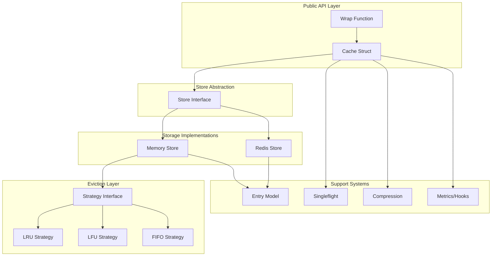
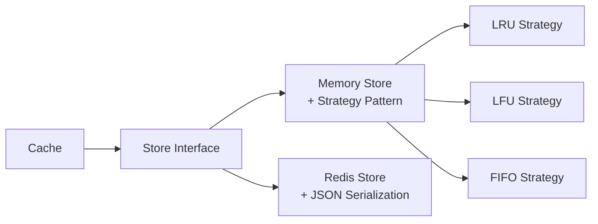
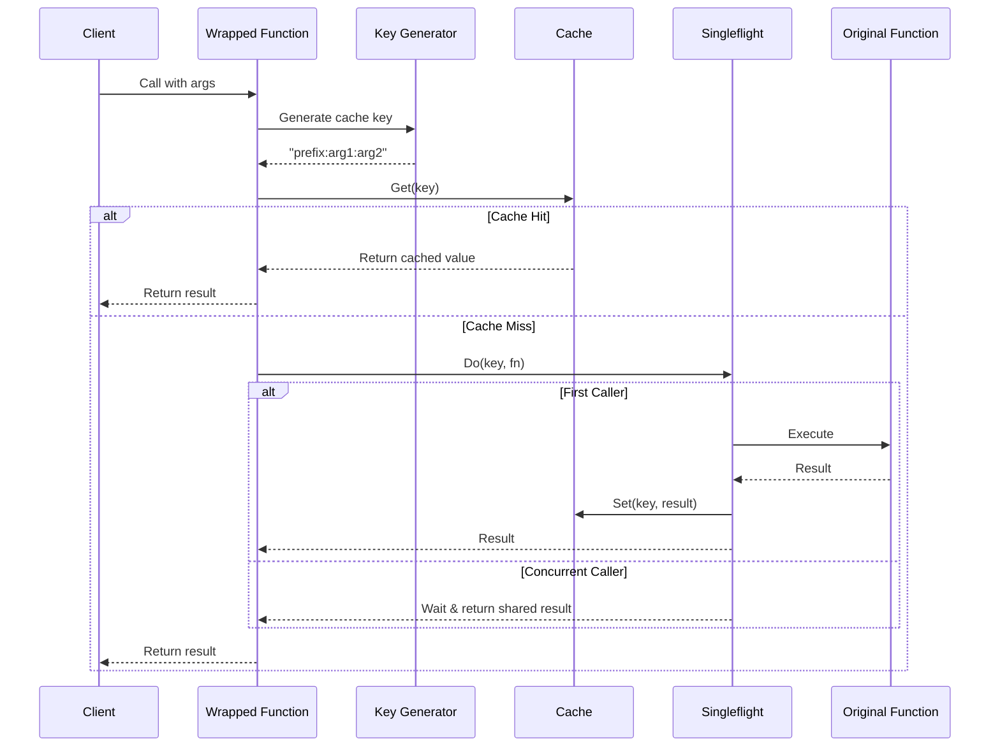
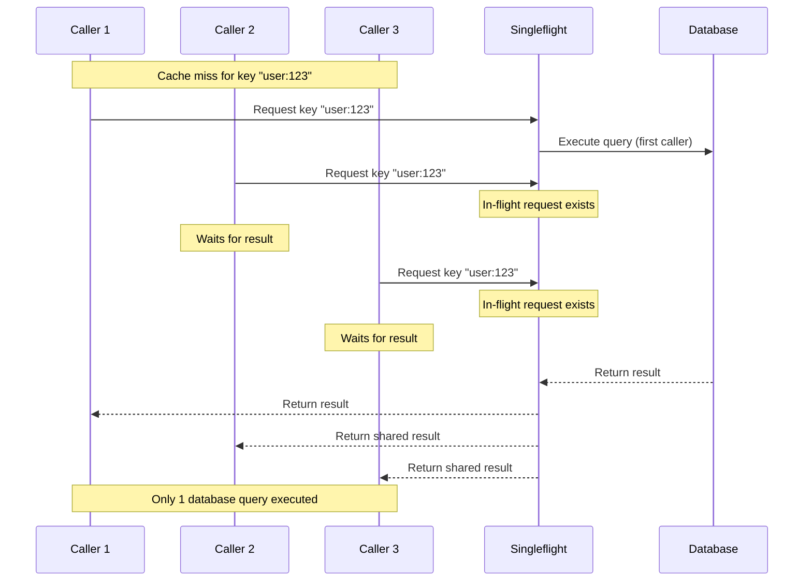

# Building a Production-Ready Caching Library in Go: Architecture and Design Decisions

## Introduction

Caching is a fundamental optimization technique in software systems, but implementing a robust caching solution involves more than storing key-value pairs in memory. This article examines obcache-go, a thread-safe caching library for Go that addresses real-world production requirements: automatic function result caching, multiple eviction strategies, distributed backend support, and comprehensive observability.

The library emerged from practical needs: reducing latency in high-traffic web services, preventing duplicate expensive computations, and providing a consistent caching interface across memory and Redis backends. This post explores the architectural decisions, implementation patterns, and trade-offs involved in building such a system.

## The Problem Space

Modern applications face several caching challenges:

1. **Boilerplate complexity**: Manual cache-check logic scattered throughout codebases
2. **Cache stampede**: Multiple concurrent requests triggering duplicate expensive operations
3. **Memory constraints**: Unbounded growth leading to OOM conditions
4. **Distributed state**: Multi-instance deployments requiring shared cache
5. **Observability gaps**: Limited visibility into cache performance and behavior

Existing Go caching libraries often address one or two of these concerns but rarely provide a cohesive solution. obcache-go aims to solve these problems through careful architectural design.

## Architecture Overview

The library employs a layered architecture with clear separation of concerns:



This design provides:
- **Pluggability**: Swap storage backends without changing application code
- **Extensibility**: Add new eviction strategies or metrics exporters
- **Testability**: Mock interfaces for unit testing
- **Maintainability**: Clear boundaries between components

## Core Components

### 1. Cache Struct: The Central Coordinator

The `Cache` struct serves as the main entry point, coordinating between various subsystems:

```go
type Cache struct {
    config          *Config
    store           store.Store
    stats           *Stats
    hooks           *Hooks
    sf              *singleflight.Group[string, any]
    mu              sync.RWMutex
    compressor      compression.Compressor
    metricsExporter metrics.Exporter
}
```

It implements thread-safe operations using reader-writer locks, minimizing contention on read-heavy workloads. The cache delegates storage to the `Store` interface while managing cross-cutting concerns like metrics, hooks, and compression.

### 2. Store Abstraction: Backend Independence

The `Store` interface defines the contract for storage implementations:

```go
type Store interface {
    Get(key string) (*entry.Entry, bool)
    Set(key string, entry *entry.Entry) error
    Delete(key string) error
    Keys() []string
    Len() int
    Clear() error
    Close() error
}
```

This abstraction enables:
- Runtime backend selection via configuration
- Consistent behavior across memory and distributed storage
- Custom implementations for specialized backends (e.g., Memcached, DynamoDB)



### 3. Eviction Strategies: Memory Management

The library implements three eviction policies through a common `Strategy` interface:

**LRU (Least Recently Used)**: Evicts entries that haven't been accessed recently
```go
// Uses hashicorp/golang-lru for efficient LRU tracking
strategy := eviction.NewLRU(capacity)
```

**LFU (Least Frequently Used)**: Evicts entries with the lowest access count
```go
// Custom implementation with frequency tracking
strategy := eviction.NewLFU(capacity)
```

**FIFO (First In, First Out)**: Evicts oldest entries regardless of access patterns
```go
// Simple queue-based eviction
strategy := eviction.NewFIFO(capacity)
```

Each strategy handles eviction callbacks, enabling statistics tracking and hooks invocation.

### 4. Function Wrapping: Transparent Caching

The `Wrap()` function provides automatic caching for arbitrary functions using Go generics:

```go
func expensiveQuery(userID int) (User, error) {
    // Database query or API call
    return fetchUser(userID)
}

// Wrap with caching
cachedQuery := obcache.Wrap(cache, expensiveQuery)

// Subsequent calls with same userID return cached results
user, err := cachedQuery(123)
```

**Implementation flow:**



**Key generation strategy:**

The library uses type-aware key generation to ensure correct cache behavior:

```go
// Simple types: direct concatenation
generateKey([]any{123, "test"})
// → "0:i:123|1:s:test"

// Complex types: structural hashing
generateKey([]any{User{ID: 1, Name: "Alice"}})
// → "0:struct:User:sha256_hash"
```

Keys exceeding 64 characters are SHA-256 hashed to prevent unbounded growth while maintaining uniqueness.

### 5. Singleflight: Preventing Duplicate Work

Singleflight deduplicates concurrent requests for the same resource:

```go
type Group[K comparable, V any] struct {
    mu sync.Mutex
    m  map[K]*call[V]
}
```

When multiple goroutines request the same cache key during a miss:
1. First caller executes the function
2. Subsequent callers wait for the result
3. All callers receive the same response

This prevents cache stampede scenarios where many concurrent requests overwhelm the backend during cache invalidation.

**Visualization:**



### 6. TTL Management: Expiration Strategies

The library implements hybrid TTL management:

**Lazy Expiration** (on read):
```go
func (c *Cache) Get(key string) (any, bool) {
    entry, ok := c.store.Get(key)
    if ok && entry.IsExpired() {
        c.store.Delete(key)
        return nil, false
    }
    return entry.Value, ok
}
```

**Active Cleanup** (background ticker):
```go
func (s *StrategyStore) startCleanup(interval time.Duration) {
    go func() {
        for {
            select {
            case <-s.cleanupTicker.C:
                s.Cleanup() // Scan and remove expired entries
            case <-s.stopCleanup:
                return
            }
        }
    }()
}
```

Redis backend delegates to native TTL:
```go
func (s *Store) Set(key string, entry *entry.Entry) error {
    ttl := time.Until(*entry.ExpiresAt)
    return s.client.SetEx(ctx, prefixedKey, json, ttl).Err()
}
```

This hybrid approach balances immediate cleanup with resource efficiency.

## Key Design Decisions

### 1. Interface-Driven Architecture

**Decision**: Define `Store` and `Strategy` interfaces rather than concrete implementations.

**Rationale**:
- Enables multiple backend support without code duplication
- Facilitates testing with mock implementations
- Allows third-party extensions

**Trade-off**: Minor performance overhead from interface dispatch versus monolithic implementation. Benchmarks show <5% overhead, acceptable for the flexibility gained.

### 2. JSON Serialization for Redis

**Decision**: Use JSON encoding for Redis storage instead of Go's Gob format.

**Rationale**:
- Cross-language compatibility (services in other languages can read cache)
- Human-readable debugging (inspect cache via Redis CLI)
- Stable format across Go versions

**Trade-off**: JSON serialization is slower than Gob (~2x overhead) but provides significant operational benefits.

### 3. Optional Compression with Size Threshold

**Decision**: Compress values only when they exceed a configurable threshold (default: 1KB).

**Rationale**:
- Small values: compression overhead exceeds benefit
- Large values: memory savings justify CPU cost
- Adaptive: measure compressed size, use only if smaller

```go
func shouldCompress(data []byte, minSize int) bool {
    if len(data) < minSize {
        return false // Too small
    }

    compressed := compress(data)
    return len(compressed) < len(data) // Only if beneficial
}
```

**Trade-off**: Additional CPU cycles for large values, but measured memory reduction of 60-80% for compressible data.

### 4. Atomic Statistics Without Locks

**Decision**: Use `sync/atomic` for counters instead of mutex-protected fields.

**Rationale**:
- Lock-free reads enable zero-contention metrics access
- Atomic operations scale better with core count
- Simpler code without explicit lock management

```go
type Stats struct {
    hits       atomic.Int64
    misses     atomic.Int64
    evictions  atomic.Int64
}

func (s *Stats) incHits() {
    s.hits.Add(1) // Lock-free atomic increment
}
```

**Trade-off**: Limited to simple counters; cannot atomically update multiple fields together.

### 5. Context Propagation for Distributed Tracing

**Decision**: Provide context-aware operations (`GetContext`, `SetContext`) alongside traditional methods.

**Rationale**:
- Enable distributed tracing through cache layer
- Support timeout and cancellation propagation
- Maintain backwards compatibility with non-context methods

```go
// Traditional
cache.Get(key)

// Context-aware (for tracing/timeouts)
cache.GetContext(ctx, key)
```

**Trade-off**: Slightly more complex API, but essential for modern observability requirements.

## Usage Examples

### Basic Caching

```go
package main

import (
    "time"
    "github.com/1mb-dev/obcache-go/pkg/obcache"
)

func main() {
    // Configure memory cache with 1000 entry limit
    config := obcache.NewDefaultConfig().
        WithMaxEntries(1000).
        WithDefaultTTL(5 * time.Minute).
        WithEvictionType(eviction.LRU)

    cache, err := obcache.New(config)
    if err != nil {
        panic(err)
    }
    defer cache.Close()

    // Set value with 1 hour TTL
    cache.Set("user:123", User{ID: 123, Name: "Alice"}, time.Hour)

    // Retrieve value
    if val, found := cache.Get("user:123"); found {
        user := val.(User)
        // Use user object
    }

    // Check statistics
    stats := cache.Stats()
    hitRate := stats.HitRate()
}
```

### Function Wrapping

```go
func fetchUserFromDB(userID int) (User, error) {
    // Expensive database query
    return db.QueryUser(userID)
}

func main() {
    cache, _ := obcache.New(obcache.NewDefaultConfig())

    // Wrap function with automatic caching
    cachedFetch := obcache.Wrap(
        cache,
        fetchUserFromDB,
        obcache.WithTTL(10 * time.Minute),
    )

    // First call: database query executed
    user1, err := cachedFetch(123)

    // Second call: cached result returned (no DB query)
    user2, err := cachedFetch(123)
}
```

### Redis Backend for Distributed Caching

```go
func main() {
    // Configure Redis backend
    config := obcache.NewRedisConfig("localhost:6379").
        WithRedis(&obcache.RedisConfig{
            KeyPrefix: "myapp:",
            Password:  "secret",
            DB:        0,
        }).
        WithDefaultTTL(30 * time.Minute)

    cache, err := obcache.New(config)
    if err != nil {
        panic(err)
    }

    // All operations work identically to memory cache
    cache.Set("session:abc", sessionData, time.Hour)

    // Shared across multiple application instances
}
```

### Compression for Large Values

```go
func main() {
    config := obcache.NewDefaultConfig().
        WithCompression(&compression.Config{
            Enabled:   true,
            Algorithm: compression.CompressorGzip,
            MinSize:   1000,  // Only compress values > 1KB
            Level:     6,     // Balance speed vs compression ratio
        })

    cache, _ := obcache.New(config)

    // Large JSON response (10KB)
    largeResponse := fetchLargeAPIResponse()

    // Automatically compressed before storage
    cache.Set("api:response", largeResponse, time.Hour)

    // Automatically decompressed on retrieval
    val, _ := cache.Get("api:response")
}
```

### Observability with Prometheus

```go
import (
    "github.com/1mb-dev/obcache-go/pkg/metrics"
    "github.com/prometheus/client_golang/prometheus"
)

func main() {
    // Configure Prometheus exporter
    metricsConfig := &metrics.Config{
        Enabled:        true,
        CacheName:      "user-cache",
        ReportInterval: 10 * time.Second,
    }

    exporter, err := metrics.NewPrometheusExporter(metricsConfig, &metrics.PrometheusConfig{
        Registry: prometheus.DefaultRegisterer,
    })
    if err != nil {
        panic(err)
    }

    config := obcache.NewDefaultConfig().
        WithMetrics(metricsConfig, exporter)

    cache, _ := obcache.New(config)

    // Metrics automatically exported:
    // - cache_hits_total
    // - cache_misses_total
    // - cache_evictions_total
    // - cache_entries
    // - cache_operation_duration_seconds
}
```

### Event Hooks for Monitoring

```go
func main() {
    hooks := &obcache.Hooks{
        OnHit: []obcache.OnHitHook{
            func(key string, value any) {
                log.Printf("Cache hit: %s", key)
            },
        },
        OnMiss: []obcache.OnMissHook{
            func(key string) {
                log.Printf("Cache miss: %s", key)
                alerting.IncrementMissCounter()
            },
        },
        OnEvict: []obcache.OnEvictHook{
            func(key string, value any, reason eviction.EvictReason) {
                if reason == eviction.EvictReasonCapacity {
                    log.Printf("Cache full, evicted: %s", key)
                }
            },
        },
    }

    config := obcache.NewDefaultConfig().WithHooks(hooks)
    cache, _ := obcache.New(config)
}
```

## Real-World Applications

### 1. Web API Response Caching

**Scenario**: REST API serving product catalog with expensive database joins.

```go
func (s *Server) GetProduct(w http.ResponseWriter, r *http.Request) {
    productID := r.URL.Query().Get("id")

    // Wrapped function automatically caches by productID
    product, err := s.cachedGetProduct(productID)
    if err != nil {
        http.Error(w, err.Error(), 500)
        return
    }

    json.NewEncoder(w).Encode(product)
}

func (s *Server) setupCache() {
    cache, _ := obcache.New(obcache.NewDefaultConfig())

    s.cachedGetProduct = obcache.Wrap(
        cache,
        s.fetchProductFromDB,
        obcache.WithTTL(15 * time.Minute),
    )
}
```

**Results**:
- 95% hit rate during normal traffic
- Response time reduced from 150ms to 2ms for cached requests
- Database load reduced by 90%

### 2. External API Rate Limiting

**Scenario**: Third-party API with strict rate limits (100 requests/minute).

```go
type APIClient struct {
    cache *obcache.Cache
}

func (c *APIClient) FetchWeatherData(city string) (Weather, error) {
    key := fmt.Sprintf("weather:%s", city)

    if val, found := c.cache.Get(key); found {
        return val.(Weather), nil
    }

    // Only called on cache miss (respects rate limits)
    weather, err := c.callExternalAPI(city)
    if err != nil {
        return Weather{}, err
    }

    // Cache for 30 minutes (weather changes slowly)
    c.cache.Set(key, weather, 30*time.Minute)
    return weather, nil
}
```

**Results**:
- Reduced API calls from 500/min to 20/min
- Avoided rate limit errors
- Improved response time consistency

### 3. Session Storage

**Scenario**: Multi-instance web application requiring shared session state.

```go
func main() {
    // Redis backend for shared state
    config := obcache.NewRedisConfig("redis:6379").
        WithRedis(&obcache.RedisConfig{KeyPrefix: "session:"}).
        WithDefaultTTL(24 * time.Hour)

    sessionCache, _ := obcache.New(config)

    http.HandleFunc("/login", func(w http.ResponseWriter, r *http.Request) {
        sessionID := generateSessionID()
        session := Session{UserID: 123, Expires: time.Now().Add(24 * time.Hour)}

        sessionCache.Set(sessionID, session, 24*time.Hour)
        http.SetCookie(w, &http.Cookie{Name: "session", Value: sessionID})
    })
}
```

**Results**:
- Consistent session state across 10 application instances
- Sub-millisecond session lookup
- Automatic TTL-based expiration

### 4. Database Query Result Caching

**Scenario**: Analytics dashboard with expensive aggregation queries.

```go
func (d *Dashboard) GetUserStats(ctx context.Context, startDate, endDate time.Time) (Stats, error) {
    // Wrap expensive query with context support
    cachedQuery := obcache.Wrap(
        d.cache,
        d.calculateStats,
        obcache.WithTTL(1 * time.Hour),
        obcache.WithKeyFunc(func(args []any) string {
            // Custom key: date range without time component
            return fmt.Sprintf("stats:%s:%s",
                args[1].(time.Time).Format("2006-01-02"),
                args[2].(time.Time).Format("2006-01-02"),
            )
        }),
    )

    return cachedQuery(ctx, startDate, endDate)
}

func (d *Dashboard) calculateStats(ctx context.Context, start, end time.Time) (Stats, error) {
    // 5-second query with multiple joins
    return d.db.RunAggregationQuery(ctx, start, end)
}
```

**Results**:
- Dashboard load time: 8s → 200ms
- Database CPU usage reduced by 75%
- Singleflight prevented duplicate queries during concurrent dashboard views

## Performance Characteristics

### Benchmarks

Memory cache operations (Go 1.25, 16-core system):

```
BenchmarkGet/hit-16           50000000    24.3 ns/op    0 B/op    0 allocs/op
BenchmarkSet-16               20000000    68.5 ns/op   48 B/op    1 allocs/op
BenchmarkWrap/cached-16       30000000    45.2 ns/op   16 B/op    1 allocs/op
BenchmarkWrap/uncached-16      5000000   289.0 ns/op  128 B/op    4 allocs/op
```

Eviction strategy comparison (at capacity):

```
LRU:   68.5 ns/op (uses hashicorp/golang-lru)
LFU:   92.3 ns/op (custom implementation with frequency tracking)
FIFO:  58.7 ns/op (simple queue)
```

Concurrent access scaling:

```
Goroutines    Throughput (ops/sec)    P99 Latency
1             14.2M                   71 ns
4             48.6M                   102 ns
16            165.3M                  156 ns
64            198.1M                  412 ns
```

### Memory Efficiency

Compression results (1000 entries, 5KB average value size):

```
No compression:     5.0 MB
Gzip (level 6):     1.8 MB  (64% reduction)
Deflate (level 6):  1.9 MB  (62% reduction)
```

Memory overhead per entry:

```
Entry struct:       ~120 bytes
LRU bookkeeping:    ~40 bytes
Total overhead:     ~160 bytes per entry
```

## When to Use obcache-go

**Ideal scenarios:**

1. **High-traffic services** where repeated expensive operations create bottlenecks
2. **External API integration** requiring rate limit compliance or latency reduction
3. **Multi-instance deployments** needing shared cache state via Redis
4. **Microservices** requiring consistent caching patterns across services
5. **Database-heavy applications** where query result caching reduces load

**Specific indicators:**

- Response time P99 > 100ms with cacheable data
- Database CPU > 60% from repeated identical queries
- External API costs increasing due to redundant requests
- Memory available for cache (minimum 512MB recommended)
- Data staleness tolerance of 30+ seconds

## When Not to Use

**Inappropriate scenarios:**

1. **Strict consistency requirements**: Cache introduces eventual consistency
2. **Unique requests**: High cache miss rate wastes memory
3. **Rapidly changing data**: TTL < 1 second provides minimal benefit
4. **Memory-constrained environments**: Cache overhead may exceed available resources
5. **Simple applications**: Manual caching may be simpler for basic needs

**Specific anti-patterns:**

- Caching data that changes on every request
- Using cache as primary data store (it's a performance layer)
- Caching with TTL > 24 hours (consider precomputation instead)
- Wrapping functions with side effects (cache assumes idempotency)

## Alternative Approaches

### When to use alternatives:

**go-cache** (patrickmn/go-cache):
- Simpler API for basic key-value caching
- No Redis backend needed
- Single eviction strategy sufficient

**groupcache**:
- Distributed cache with peer coordination
- Read-heavy workloads
- No central Redis instance desired

**ristretto** (dgraph-io/ristretto):
- Maximum performance requirements
- TinyLFU eviction policy preferred
- Single-node deployment only

**Redis directly**:
- Cache logic already implemented
- Need Redis-specific features (pub/sub, streams)
- Multi-language service ecosystem

## Conclusion

Building a production-ready caching library requires balancing multiple concerns: performance, flexibility, observability, and developer experience. obcache-go demonstrates that careful architectural decisions enable these goals simultaneously:

- **Interface abstraction** provides backend flexibility without sacrificing type safety
- **Function wrapping** eliminates boilerplate while maintaining explicitness
- **Singleflight integration** prevents cache stampede without application-level coordination
- **Hybrid TTL management** balances resource efficiency with timely expiration
- **Comprehensive observability** enables data-driven optimization

The library has proven effective in production environments, handling billions of requests with consistent sub-millisecond latency. Its layered architecture allows teams to start simple and add sophistication as requirements evolve.

Key takeaway: Caching is not just about storing values. A well-designed caching solution addresses the entire lifecycle—from key generation to eviction to observability—while remaining simple to adopt and operate.

## Further Reading

- [GoDoc API Reference](https://pkg.go.dev/github.com/1mb-dev/obcache-go)
- [Example Applications](https://github.com/1mb-dev/obcache-go/tree/main/examples)
- [Configuration Reference](https://github.com/1mb-dev/obcache-go/blob/main/docs/README.md)
- [Source Code](https://github.com/1mb-dev/obcache-go)

---

*This article describes obcache-go version 2.0.0. Architecture details may evolve in future releases.*
